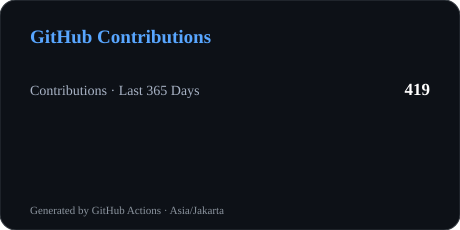
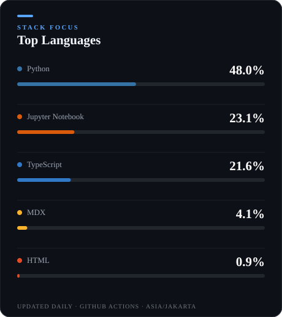
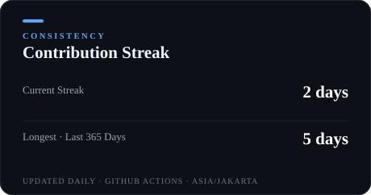

<p align="center">
  <a href="https://github.com/CodeByAbi">
    
  </a>
</p>

<p align="center">
  
  
  
  
</p>

<p align="center">
  <a href="https://www.linkedin.com/in/abiwisnu">
    
  </a>
  <a href="https://www.instagram.com/abiwisnu">
    
  </a>
  <a href="https://github.com/CodeByAbi">
    
  </a>
</p>

---

## About

I'm **Abira Wisnunggal**, a Data Science student focused on **AI Engineering, Machine Learning, and practical Generative AI systems**.

My main interests sit at the intersection of **LLMs, RAG, OCR / Document AI, machine learning, and backend engineering** — turning data, documents, and models into usable AI applications rather than isolated experiments.

I'm currently deepening my understanding of **MLOps, LLMOps, AI system design, retrieval pipelines, model evaluation, and scalable AI application architecture**.

> **Build the model. Engineer the system. Make the intelligence useful.**

---

## Current Focus

<table>
  <tr>
    <td width="50%">
      <strong>AI Engineering</strong><br/>
      Designing practical AI applications around models, retrieval, APIs, and data.
    </td>
    <td width="50%">
      <strong>LLM Applications</strong><br/>
      Building applications that combine language models with structured system logic.
    </td>
  </tr>
  <tr>
    <td>
      <strong>Retrieval-Augmented Generation</strong><br/>
      Embeddings, retrieval pipelines, knowledge bases, and grounded generation.
    </td>
    <td>
      <strong>OCR & Document AI</strong><br/>
      Exploring document understanding, OCR pipelines, and image-based information extraction.
    </td>
  </tr>
  <tr>
    <td>
      <strong>Machine Learning & Deep Learning</strong><br/>
      Classical ML, computer vision, neural networks, experimentation, and evaluation.
    </td>
    <td>
      <strong>MLOps & LLMOps</strong><br/>
      Learning how to move AI workloads toward reliable, maintainable systems.
    </td>
  </tr>
</table>

---

## AI Engineering Toolkit

```text
┌──────────────────────┐
│   DATA / DOCUMENTS   │
└──────────┬───────────┘
           │
           ▼
┌──────────────────────┐
│ PREPROCESSING / EDA  │
└──────────┬───────────┘
           │
           ▼
┌──────────────────────┐
│ EMBEDDINGS / ML / DL │
└──────────┬───────────┘
           │
           ▼
┌──────────────────────┐
│ RETRIEVAL / INFERENCE│
└──────────┬───────────┘
           │
           ▼
┌──────────────────────┐
│ LLM / AI LOGIC       │
└──────────┬───────────┘
           │
           ▼
┌──────────────────────┐
│ API / ASYNC WORKERS  │
└──────────┬───────────┘
           │
           ▼
┌──────────────────────┐
│ DATABASE / DEPLOYMENT│
└──────────────────────┘
```

The goal is not to showcase a single model.  
It's to understand the **full path from raw information → intelligence → application**.

---

## Technical Stack

### AI / Machine Learning

<p>
  
  
  
  
  
  
  
  
</p>

### LLM / AI Engineering

`LLM` · `RAG` · `Embeddings` · `Vector Databases` · `Text-to-SQL` · `OCR` · `Document AI` · `LLM Evaluation`

`LangChain` · `LangGraph` · `LlamaIndex` · `FastAPI`

### Data / Backend / Infrastructure

<p>
  
  
  
  
  
  
  
</p>

### Data Science / Visualization

<p>
  
  
  
</p>

<details>
<summary><strong>Secondary stack</strong></summary>

<br/>

**Web / Application:**  
TypeScript · Node.js · Express.js · Next.js · Tailwind CSS · Prisma

**Cloud / Deployment:**  
AWS · Azure · Google Cloud · Vercel

**Development:**  
Git · GitHub · Bitbucket

**Databases / Storage:**  
MongoDB · Firebase · pgvector

</details>

---

## Featured AI / ML Projects

The projects below are selected from the repositories currently featured on my GitHub profile.

<table>
  <tr>
    <td width="50%">
      <h3><a href="https://github.com/CodeByAbi/DemoLabs-AI-Chatbot">DemoLabs AI Chatbot</a></h3>
      <p>
        AI chatbot orchestrator covering <strong>RAG, Text-to-SQL, OCR, semantic intent routing, and dynamic data visualization</strong>, with an asynchronous worker architecture.
      </p>
      <code>Python</code> · <code>FastAPI</code> · <code>RabbitMQ</code> · <code>Redis</code> · <code>Docker</code>
    </td>
    <td width="50%">
      <h3><a href="https://github.com/CodeByAbi/Traffic-Monitoring-System">Traffic Monitoring System</a></h3>
      <p>
        Computer vision project focused on vehicle detection and tracking using <strong>YOLOv8</strong> and <strong>DeepSORT</strong>.
      </p>
      <code>Python</code> · <code>YOLOv8</code> · <code>DeepSORT</code> · <code>OpenCV</code>
    </td>
  </tr>
  <tr>
    <td>
      <h3><a href="https://github.com/CodeByAbi/Rainfall-Prediction-in-Australia">Rainfall Prediction in Australia</a></h3>
      <p>
        End-to-end machine learning workflow covering <strong>EDA, cleaning, feature engineering, model training, tuning, and evaluation</strong> for rainfall prediction.
      </p>
      <code>Python</code> · <code>scikit-learn</code> · <code>Machine Learning</code>
    </td>
    <td>
      <h3><a href="https://github.com/CodeByAbi/Nuxio">Nuxio</a></h3>
      <p>
        AI-assisted financial planning workspace concept combining financial planning workflows with an intelligent assistant. <strong>Early scaffold</strong>.
      </p>
      <code>TypeScript</code> · <code>Next.js</code> · <code>AI Application</code>
    </td>
  </tr>
</table>

<p align="center">
  <a href="https://github.com/CodeByAbi?tab=repositories">
    
  </a>
</p>

---

## GitHub Activity

> The cards below are generated into this repository by GitHub Actions.  
> They are intentionally stored locally instead of relying on public stats endpoints with aggressive caching.

<p align="center">
  
  
</p>


<p align="center">
  
  <a href="https://github.com/CodeByAbi" target="_blank">
    
  </a>
</p>

## 🐍 Contribution Snake

<br/>

<p align="center">
  <picture>
    <source media="(prefers-color-scheme: dark)" srcset="profile/github-snake-dark.svg">
    <source media="(prefers-color-scheme: light)" srcset="profile/github-snake.svg">
    
  </picture>
</p>

## 🏆 GitHub Trophies

<p align="center">
  
</p>

---

## What I'm Building Toward

```text
                 AI ENGINEERING
                       │
          ┌────────────┼────────────┐
          ▼            ▼            ▼
        LLMs          RAG         OCR / CV
          │            │            │
          └────────────┼────────────┘
                       ▼
                AI APPLICATIONS
                       │
          ┌────────────┼────────────┐
          ▼            ▼            ▼
        APIs       Retrieval     Data Layer
          │            │            │
          └────────────┼────────────┘
                       ▼
             RELIABLE AI SYSTEMS
```

My direction is to keep strengthening the engineering layer around AI:

**model → retrieval → orchestration → backend → data → deployment**

without losing the data science foundation underneath it.

---

## Let's Build Something Intelligent

<p align="center">
  <a href="https://www.linkedin.com/in/abiwisnu">
    
  </a>
  <a href="https://www.instagram.com/abiwisnu">
    
  </a>
  <a href="https://github.com/CodeByAbi">
    
  </a>
</p>

<p align="center">
  
</p>

<p align="center">
  <sub>AI Engineering · Machine Learning · LLM · RAG · OCR · Document AI · Data Science</sub>
</p>
