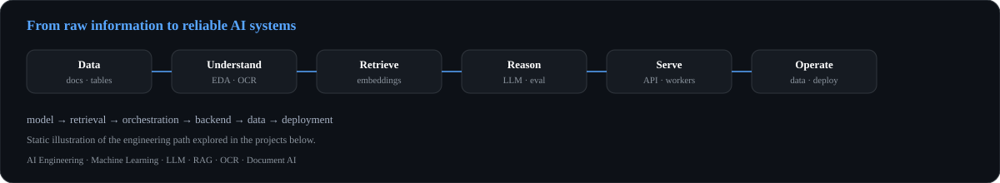
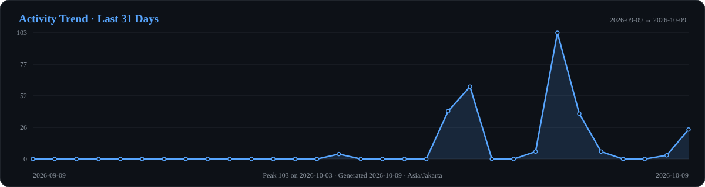
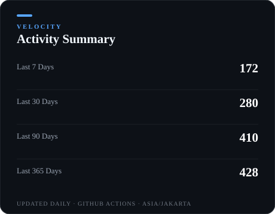

  

  

  
  
  
  

  
  
  

---

## About

I'm **Abira Wisnunggal**, a Data Science student working toward **AI Engineering** — building LLM-based applications that hold up outside the notebook.

Most of my work sits where models meet systems: **LLM applications, retrieval-augmented generation, OCR, and document understanding**, wired together with backend services and data layers. I care less about isolated model experiments than about whether the full pipeline answers correctly, runs predictably, and stays maintainable as it grows.

Alongside that I'm building the operating side of AI systems — **MLOps, LLMOps, model evaluation, retrieval design, and system architecture** — because the distance between a working prototype and a usable product is mostly engineering.

> **Build the model. Engineer the system. Make the intelligence useful.**

---

## Current Focus

<table>
  <tr>
    <td width="50%">
      <strong>AI Engineering</strong> 
      Designing practical AI applications around models, retrieval, APIs, and data.
    </td>
    <td width="50%">
      <strong>LLM Applications</strong> 
      Building applications that combine language models with structured system logic.
    </td>
  </tr>
  <tr>
    <td>
      <strong>Retrieval-Augmented Generation</strong> 
      Embeddings, retrieval pipelines, knowledge bases, and grounded generation.
    </td>
    <td>
      <strong>OCR &amp; Document AI</strong> 
      Exploring document understanding, OCR pipelines, and image-based information extraction.
    </td>
  </tr>
  <tr>
    <td>
      <strong>Machine Learning &amp; Deep Learning</strong> 
      Classical ML, computer vision, neural networks, experimentation, and evaluation.
    </td>
    <td>
      <strong>MLOps &amp; LLMOps</strong> 
      Learning how to move AI workloads toward reliable, maintainable systems.
    </td>
  </tr>
</table>

---

## AI Engineering Toolkit

  

The goal is not to showcase a single model.  
It's to understand the **full path from raw information → intelligence → application**.

**model → retrieval → orchestration → backend → data → deployment**

---

## Technical Stack

### AI / Machine Learning

  
  
  
  
  
  
  
  

### LLM / AI Engineering

`LLM` · `RAG` · `Embeddings` · `Vector Databases` · `Text-to-SQL` · `OCR` · `Document AI` · `LLM Evaluation`

`LangChain` · `LangGraph` · `LlamaIndex` · `FastAPI`

### Data / Backend / Infrastructure

  
  
  
  
  
  
  

### Data Science / Visualization

  
  
  

<strong>Secondary stack</strong>

 

**Web / Application:**  
TypeScript · Node.js · Express.js · Next.js · Tailwind CSS · Prisma

**Cloud / Deployment:**  
AWS · Google Cloud · Vercel

**Development:**  
Git · GitHub · Bitbucket

**Databases / Storage:**  
MongoDB · pgvector

---

## Featured AI / ML Projects

Selected repositories — each card describes the problem, the approach, and the stack as documented in that repository.

<table>
  <tr>
    <td width="50%">
      <h3><a href="https://github.com/CodeByAbi/DemoLabs-AI-Chatbot">DemoLabs AI Chatbot</a></h3>
      

        AI chatbot orchestrator covering <strong>RAG, Text-to-SQL, OCR, semantic intent routing, and dynamic data visualization</strong>, with an asynchronous worker architecture.
      

      
Problem → approach: fragmented AI capabilities (retrieval, SQL, documents) unified behind intent routing and async workers.

      <code>Python</code> · <code>FastAPI</code> · <code>RabbitMQ</code> · <code>Redis</code> · <code>Docker</code>
    </td>
    <td width="50%">
      <h3><a href="https://github.com/CodeByAbi/Traffic-Monitoring-System">Traffic Monitoring System</a></h3>
      

        Computer vision project focused on vehicle detection and tracking using <strong>YOLOv8</strong> and <strong>DeepSORT</strong>.
      

      
Problem → approach: traffic observation automated with detection plus multi-object tracking over video frames.

      <code>Python</code> · <code>YOLOv8</code> · <code>DeepSORT</code> · <code>OpenCV</code>
    </td>
  </tr>
  <tr>
    <td>
      <h3><a href="https://github.com/CodeByAbi/Rainfall-Prediction-in-Australia">Rainfall Prediction in Australia</a></h3>
      

        End-to-end machine learning workflow covering <strong>EDA, cleaning, feature engineering, model training, tuning, and evaluation</strong> for rainfall prediction.
      

      
Problem → approach: weather-station data taken from raw observations through to evaluated classification models.

      <code>Python</code> · <code>scikit-learn</code> · <code>Machine Learning</code>
    </td>
    <td>
      <h3><a href="https://github.com/CodeByAbi/Nuxio">Nuxio</a></h3>
      

        AI-powered financial planning workspace for <strong>budgets, transactions, cashflow forecasting, and intelligent assistance</strong>.
      

      
Problem → approach: personal finance workflows combined with an AI assistant inside a planning workspace.

      <code>TypeScript</code> · <code>Next.js</code> · <code>AI Application</code>
    </td>
  </tr>
</table>

  

---

## GitHub Activity

> All cards below are generated into this repository by GitHub Actions (`Update Profile Statistics`, daily + on push + manual dispatch).
> They are intentionally stored locally instead of relying on public stats endpoints with aggressive caching.

  

  
  

  
  

## Contribution Snake

 

  <picture>
    <source media="(prefers-color-scheme: dark)" srcset="profile/github-snake-dark.svg">
    <source media="(prefers-color-scheme: light)" srcset="profile/github-snake.svg">
    
  </picture>

## GitHub Trophies

  

---

## What I'm Building Toward

My direction is to keep strengthening the engineering layer around AI:

**model → retrieval → orchestration → backend → data → deployment**

without losing the data science foundation underneath it — from LLM and RAG systems through OCR and vision down to the APIs, retrieval, and data layers that make them reliable.

---

## Let's Build Something Intelligent

  
  
  

  

  AI Engineering · Machine Learning · LLM · RAG · OCR · Document AI · Data Science

